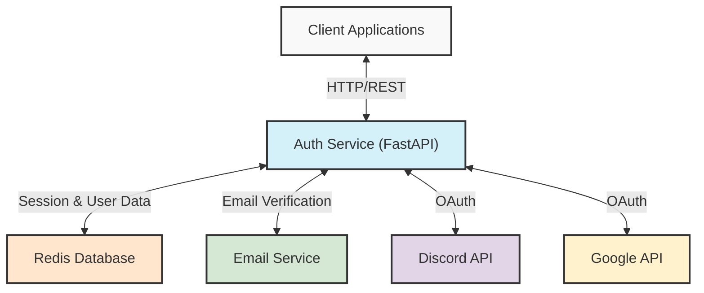
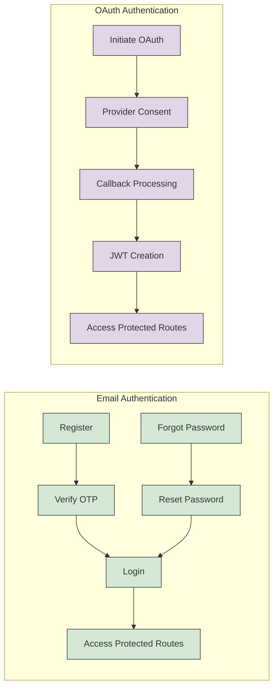
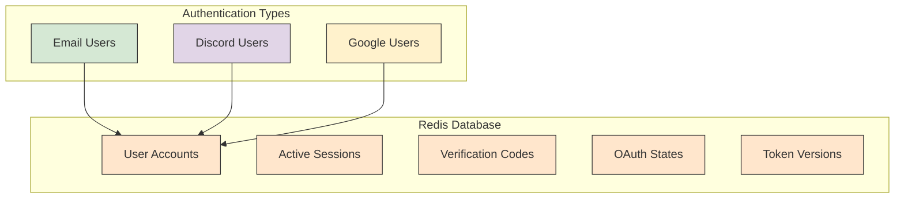

# 🔐 Multi-Provider Authentication Service

A comprehensive FastAPI-based authentication service supporting **Email/Password**, **Discord OAuth**, and **Google OAuth** authentication methods with JWT token management and Redis session storage.

## 📋 Table of Contents

- [Features](#-features)
- [Architecture Overview](#-architecture-overview)
- [Quick Start](#-quick-start)
- [API Endpoints](#-api-endpoints)
- [Authentication Flows](#-authentication-flows)
- [Security Features](#-security-features)
- [Testing](#-testing)
- [Troubleshooting](#-troubleshooting)

## 🌟 Features

### Core Authentication
- **Email/Password Registration** with OTP email verification
- **JWT Token-based Authentication** with version control
- **Password Reset** via secure email links
- **Session Management** with Redis storage
- **Token Versioning** for immediate security invalidation

### OAuth Providers
- **Discord OAuth 2.0** integration with user data retrieval
- **Google OAuth 2.0** integration with profile information
- **Multi-provider user management** in unified system
- **State management** for secure OAuth flows

### Security & Performance
- **Argon2 & BCrypt** password hashing algorithms
- **CORS-enabled** for cross-origin requests
- **Rate limiting** via Redis TTL mechanisms
- **Secure token handling** with configurable expiration
- **Input validation** with Pydantic models
- **SQL injection prevention** and XSS protection

## 🏗️ Architecture Overview

### System Architecture


### Authentication Flows


### Data Storage Model


### Project Structure
```
Authentication_Email_Discord_Google/
├── auth_service/                 # Main authentication service
│   ├── main.py                  # FastAPI application entry point
│   ├── config.py                # Configuration and environment variables
│   ├── dependencies.py          # Authentication dependencies & middleware
│   ├── email_test_frontend.html # Comprehensive testing interface
│   ├── mock_email_auth_test.py  # Mock testing without server
│   ├── env_template.txt         # Environment configuration template
│   ├── routers/
│   │   └── auth.py             # All authentication endpoints
│   └── utils/                   # Utility modules
│       ├── discord.py          # Discord OAuth implementation
│       ├── email.py            # Email sending functionality
│       ├── google.py           # Google OAuth implementation
│       ├── redis.py            # Redis connection & helpers
│       └── security.py         # JWT & password security
├── requirements.txt             # Python dependencies
└── README.md                   # This documentation
```

## 🚀 Quick Start

### Prerequisites
- **Python 3.8+**
- **Redis Server** (local or cloud)
- **SMTP Access** (Gmail, SendGrid, etc.)
- **Discord Developer App** (for Discord OAuth)
- **Google Cloud Project** (for Google OAuth)
- **Optional**: Install `argon2-cffi` for Argon2 password hashing (recommended for production)

### Service URLs
- **API Documentation**: http://127.0.0.1:8000/docs
- **Interactive API**: http://127.0.0.1:8000/redoc

## 📚 API Endpoints

### Email Authentication Endpoints

#### 1. User Registration
```http
POST /register
Content-Type: application/json

{
  "email": "user@example.com",
  "password": "SecurePassword123"
}
```

**Response (201):**
```json
{
  "message": "OTP sent to email",
  "email": "user@example.com"
}
```

**Functionality:**
- Validates password length (minimum 8 characters)
- Checks for existing email registration
- Creates inactive user account
- Generates 6-digit OTP with 5-minute expiration
- Sends OTP via email in background task

---

#### 2. Verify Registration OTP
```http
POST /verify-registration-otp
Content-Type: application/json

{
  "email": "user@example.com",
  "otp": "123456"
}
```

**Response (200):**
```json
{
  "message": "Account activated successfully"
}
```

**Functionality:**
- Retrieves and validates OTP from Redis
- Activates user account upon successful verification
- Deletes OTP from Redis after use

---

#### 3. User Login
```http
POST /token
Content-Type: application/x-www-form-urlencoded

username=user@example.com&password=SecurePassword123&grant_type=password
```

**Response (200):**
```json
{
  "access_token": "eyJhbGciOiJIUzI1NiIsInR5cCI6IkpXVCJ9...",
  "token_type": "bearer"
}
```

**Functionality:**
- Validates user existence and active status
- Verifies password using bcrypt/argon2
- Creates JWT token with user ID and version
- Includes token versioning for security

---

#### 4. Forgot Password
```http
POST /forgot-password
Content-Type: application/json

{
  "email": "user@example.com"
}
```

**Response (200):**
```json
{
  "message": "If the email exists, a reset link has been sent"
}
```

**Functionality:**
- Always returns success to prevent email enumeration
- Generates unique reset token with 15-minute expiration
- Stores reset token in Redis
- Sends reset link via email

---

#### 5. Reset Password
```http
POST /reset-password
Content-Type: application/json

{
  "token": "reset_12345_1640995200",
  "new_password": "NewSecurePassword123"
}
```

**Response (200):**
```json
{
  "message": "Password updated successfully"
}
```

**Functionality:**
- Validates reset token from Redis
- Updates password with new hash
- Increments token version to invalidate existing sessions
- Deletes reset token after use

---

### OAuth Endpoints

#### 6. Discord OAuth Login
```http
GET /discord/login?redirect_uri=http://localhost:3000/dashboard
```

**Response (307):** Redirects to Discord OAuth page

**Functionality:**
- Generates secure state parameter
- Stores state data in Redis with 10-minute expiration
- Constructs Discord authorization URL
- Redirects user to Discord for authentication

---

#### 7. Discord OAuth Callback
```http
GET /auth/discord/callback?code=OAUTH_CODE&state=STATE_TOKEN
```

**Response (200):**
```json
{
  "message": "Discord authentication successful",
  "user_id": "discord_user_id",
  "username": "discord_username"
}
```

**Functionality:**
- Validates state parameter against Redis storage
- Exchanges authorization code for access token
- Retrieves Discord user information
- Stores user data in Redis with 1-hour expiration
- Creates JWT token with Discord source identifier

---

#### 8. Google OAuth Login
```http
GET /login/google?redirect_uri=http://localhost:3000/dashboard
```

**Response (307):** Redirects to Google OAuth page

**Functionality:**
- Generates secure state parameter for CSRF protection
- Stores state in Redis with expiration
- Constructs Google authorization URL with required scopes
- Redirects to Google OAuth consent screen

---

#### 9. Google OAuth Callback
```http
GET /authorize?code=OAUTH_CODE&state=STATE_TOKEN
```

**Response (200):**
```json
{
  "message": "Google authentication successful",
  "user_id": "google_user_id",
  "email": "user@gmail.com",
  "name": "User Name"
}
```

**Functionality:**
- Validates state parameter
- Exchanges code for Google access token
- Retrieves user profile from Google API
- Stores user data with source identifier
- Creates JWT with Google source flag

---

### Protected Endpoints

#### 10. Get User Profile
```http
GET /profile
Authorization: Bearer YOUR_JWT_TOKEN
```

**Response varies by source:**

**Regular User:**
```json
{
  "user_id": "123",
  "email": "user@example.com",
  "is_active": "1",
  "source": "regular"
}
```

**Discord User:**
```json
{
  "user_id": "discord_id",
  "username": "discord_username",
  "email": "user@example.com",
  "avatar": "avatar_hash",
  "verified": "true",
  "source": "discord"
}
```

**Google User:**
```json
{
  "user_id": "google_id",
  "name": "User Name",
  "email": "user@gmail.com",
  "picture": "https://profile-pic-url",
  "verified": "true",
  "source": "google"
}
```

**Functionality:**
- Decodes and validates JWT token
- Checks token version against current version in Redis
- Retrieves user data based on authentication source
- Returns source-specific user information

---

#### 11. Protected Route (Test)
```http
GET /protected
Authorization: Bearer YOUR_JWT_TOKEN
```

**Response (200):**
```json
{
  "user_id": "123",
  "message": "Protected content"
}
```

**Functionality:**
- Validates JWT token structure and expiration
- Returns basic user identification
- Demonstrates protected endpoint pattern

---

#### 12. Logout
```http
GET /logout
```

**Response (200):**
```json
{
  "message": "Logged out successfully"
}
```

**Functionality:**
- Provides endpoint for logout confirmation
- Client-side should clear stored tokens

## 🔄 Authentication Flows

### Email Registration & Login Flow

1. **Registration**: `POST /register` → User created (inactive) → OTP sent via email
2. **Verification**: `POST /verify-registration-otp` → OTP validated → Account activated
3. **Login**: `POST /token` → Credentials validated → JWT token returned
4. **Access**: Use JWT token in `Authorization: Bearer` header for protected routes

### OAuth Flow (Discord/Google)

1. **Initiate**: `GET /discord/login` or `GET /login/google` → Redirect to OAuth provider
2. **Authorize**: User grants permission on provider's site
3. **Callback**: Provider redirects to callback URL with authorization code
4. **Exchange**: Service exchanges code for access token and retrieves user info
5. **Session**: JWT token created and user data stored in Redis

### Password Reset Flow

1. **Request**: `POST /forgot-password` → Reset token generated → Email sent
2. **Reset**: `POST /reset-password` → Token validated → Password updated → Token version incremented

## 🔒 Security Features

### Password Security
- **Multiple Hashing Algorithms**: Argon2 (preferred, requires `argon2-cffi` package) and BCrypt support
- **Minimum Length Requirement**: 8 characters enforced
- **Secure Password Reset**: Time-limited tokens with single use

### JWT Token Security
- **Token Versioning**: Each user has a token version stored in Redis
- **Version Validation**: All requests validate current token version
- **Immediate Invalidation**: Password changes increment version, invalidating all tokens
- **Configurable Expiration**: Default 1 hour, configurable via environment
- **Source Identification**: Tokens include authentication source (regular/discord/google)

### Session Management
- **Redis-based Storage**: All session data stored in Redis with TTL
- **Automatic Cleanup**: Redis TTL handles expired session cleanup
- **Concurrent Session Handling**: Multiple devices supported with version control
- **OAuth State Validation**: Secure state parameters prevent CSRF attacks

### Input Validation & Security
- **Pydantic Models**: Strong typing and validation for all request data
- **Email Format Validation**: Proper email format enforcement
- **SQL Injection Prevention**: Parameterized queries and ORM usage
- **XSS Protection**: Input sanitization and output encoding
- **CORS Configuration**: Properly configured for production deployment

### Rate Limiting & Protection
- **OTP Expiration**: 5-minute time limit for OTP codes
- **Reset Token Expiration**: 15-minute limit for password reset
- **OAuth State Expiration**: 10-minute limit for OAuth state parameters
- **Email Enumeration Prevention**: Consistent responses for invalid emails

## 🧪 Testing

### Comprehensive Test Interface

The service includes a complete HTML-based testing interface at `auth_service/email_test_frontend.html` that provides:

#### Test Features:
- **User Registration & OTP Testing**: Full registration flow with OTP validation
- **Login Testing**: Credential validation and token receipt
- **Password Reset Testing**: Complete forgot/reset password flow
- **Protected Route Testing**: Authenticated endpoint testing
- **OAuth Testing**: Discord and Google OAuth integration testing
- **API Status Monitoring**: Real-time API availability checking

#### Test Interface Capabilities:
- **Auto-fill Test Data**: Keyboard shortcut (Ctrl+Shift+T) for quick testing
- **Real-time Response Display**: Formatted JSON responses with success/error indicators
- **Token Management**: Automatic token storage and usage for protected routes
- **Multi-provider Testing**: Test all authentication methods in one interface
- **Error Handling**: Comprehensive error display and debugging information

#### Usage:
1. Start the FastAPI server: `python main.py`
2. Open `email_test_frontend.html` in any web browser
3. Follow the testing instructions provided in the interface

### Mock Testing (No Server Required)

For testing without a running server:
```bash
cd auth_service
python mock_email_auth_test.py
```

This provides complete functionality testing with mock data and simulated email sending.

### Manual API Testing

Using cURL for direct API testing:

```bash
# Register user
curl -X POST "http://127.0.0.1:8000/register" \
  -H "Content-Type: application/json" \
  -d '{"email":"test@example.com","password":"password123"}'

# Login
curl -X POST "http://127.0.0.1:8000/token" \
  -H "Content-Type: application/x-www-form-urlencoded" \
  -d "username=test@example.com&password=password123&grant_type=password"

# Access protected route
curl -X GET "http://127.0.0.1:8000/profile" \
  -H "Authorization: Bearer YOUR_JWT_TOKEN"
```

## ⚙️ Configuration

### Environment Variables

Create `.env` file in `auth_service/` directory:

```env
# Server Configuration
SERVER_HOST=127.0.0.1
SERVER_PORT=8000

# JWT Configuration
JWT_SECRET=your-production-secret-key-make-it-very-long-and-secure
JWT_ALG=HS256
ACCESS_TTL=3600

# Redis Configuration
REDIS_HOST=your-redis-host
REDIS_PORT=13632
REDIS_USERNAME=your-username
REDIS_PASSWORD=your-secure-password

# SMTP Configuration
SMTP_HOST=smtp.gmail.com
SMTP_PORT=587
SMTP_USER=your-email@gmail.com
SMTP_PASS=your-app-password
EMAIL_FROM=noreply@yourdomain.com

# Discord OAuth
DISCORD_CLIENT_ID=your-discord-client-id
DISCORD_CLIENT_SECRET=your-discord-client-secret
DISCORD_REDIRECT_URI=http://127.0.0.1:8000/auth/discord/callback
DISCORD_AUTH_SCOPES=identify email

# Google OAuth
GOOGLE_CLIENT_ID=your-google-client-id
GOOGLE_CLIENT_SECRET=your-google-client-secret
GOOGLE_REDIRECT_URI=http://127.0.0.1:8000/authorize
```

## 🐛 Troubleshooting

### Common Issues

#### 1. ASGI Import Error
**Symptom**: `ModuleNotFoundError` when starting server
**Solution**: Ensure you're running from the `auth_service` directory
```bash
cd auth_service
python main.py
```

#### 2. Redis Connection Failed
**Symptom**: `Redis connection failed` errors
**Solutions**:
- Verify Redis server is running
- Check Redis credentials in `.env` file
- Confirm Redis port and host configuration
- Test Redis connection: `redis-cli ping`

#### 3. Email OTP Not Received
**Symptom**: OTP emails not arriving
**Solutions**:
- Check SMTP settings in `.env` file
- Verify email credentials (use App Passwords for Gmail)
- Check spam/junk folder
- Review server logs for email sending errors

#### 4. OAuth Redirect Mismatch
**Symptom**: OAuth callbacks failing with redirect URI errors
**Solutions**:
- Ensure exact URI matching in provider settings
- Check for trailing slashes in URLs
- Verify HTTP vs HTTPS in development vs production
- Confirm port numbers match between config and provider

#### 5. Token Validation Errors
**Symptom**: Protected routes returning 401 errors
**Solutions**:
- Check JWT secret configuration
- Verify token hasn't expired
- Ensure proper Authorization header format: `Bearer <token>`
- Check if password was recently changed (invalidates tokens)

#### 6. Password Reset Email Configuration
**Symptom**: Password reset emails contain placeholder URLs
**Solutions**:
- The code contains a placeholder reset link (`https://yourapp.com`) in `auth.py` line 237
- Configure a proper `BASE_URL` environment variable for your domain
- Update the reset link generation to use your actual frontend URL

### Debug Mode

Enable detailed logging:
```bash
cd auth_service
uvicorn main:app --host 127.0.0.1 --port 8000 --reload --log-level debug
```

### Health Checks

Monitor these endpoints:
- **API Documentation**: `GET /docs`
- **Redis Connection**: Check logs for connection status
- **Note**: No dedicated health check endpoint is currently implemented
